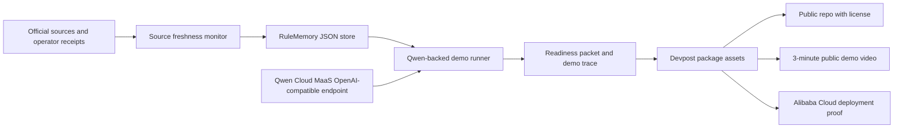

# RuleMemory Architecture Diagram

Updated: 2026-06-07 KST

## System Diagram

## Components

| Component | Current artifact | Purpose |
|---|---|---|
| Source freshness monitor | `stale_after_hours` field per source in `docs/rule_memory_live_seed_20260607.json` | Marks contest rule/source evidence stale after a configurable window so the agent re-fetches before drift. |
| RuleMemory JSON store | `docs/rule_memory_live_seed_20260607.json` | Persists deadline, track, Qwen proof, and next package decisions. |
| Qwen Cloud MaaS client | `deploy/alibaba_cloud/qwen_maas_client.py` | Demonstrates Qwen/Alibaba Cloud API usage without storing secrets. |
| Demo runner | `scripts/qwen_rule_memory_demo.sh` | Calls Qwen, reads memory seed, and emits demo trace/readiness packet. |
| Readiness packet | `docs/rule_memory_readiness_packet.md` | Hands off remembered facts and next actions across sessions. |
| Public package checklist | `docs/public_package_checklist.md` | Tracks Devpost-required assets. |

## Data Flow

1. Official pages and operator receipts are represented as source records.
2. RuleMemory stores source-linked entries with confidence and stale policy.
3. The demo runner sends a compact seed summary to Qwen.
4. Qwen returns remembered facts, stale-risk warning, and next action.
5. The packet generator refreshes the readiness packet for the next agent.
6. Public package assets reference only sanitized evidence paths.

## Deployment Proof Plan

The Devpost package should link to `deploy/alibaba_cloud/qwen_maas_client.py`
as the code-file proof that the backend uses Alibaba Cloud/Qwen Cloud services.
When an Alibaba Cloud runtime is available, run that same client from the
deployment environment and capture a short recording showing:

- runtime environment name
- Qwen MaaS base URL placeholder or sanitized host
- successful model/chat response status
- generated readiness packet path

No API key or shell history should be visible in the recording.
